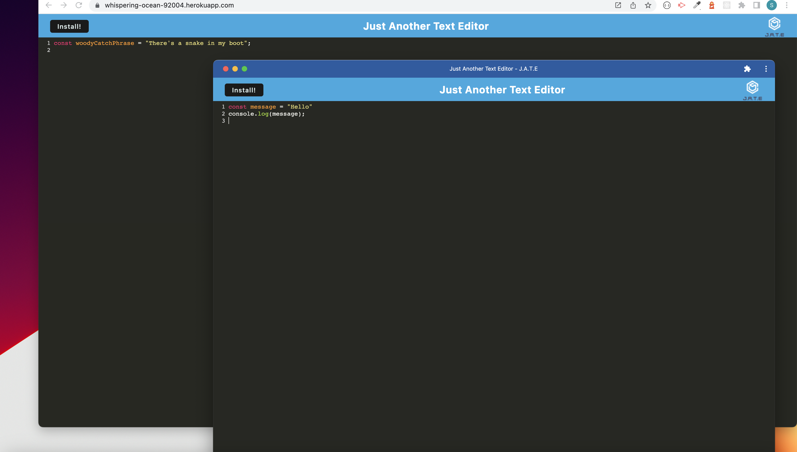

# A Breakdown of JATE Text Editor Challenge

## Description of Week 19 Challenge: PWAs or Progressive Web Applications

The motivation behind creating this project was to build a text editor that runs in the browser as a single-page application. 

This project was built to demonstrate the functionality of Progressive Web Apps or PWAs. Since the application meets PWA criteria, a user can download the application and run it on their computer like a native app with a desktop icon as well. 

This project allows for users to have a text editor that runs without internet due to multiple means of data persistence to make sure the application is usable across many browsers.

This project reinforces concepts that go into making a PWA such as webpack, service workers and indexedDB.

## Table of Contents 

- [Installation](#installation)
- [Usage](#usage)
- [Contribution](#contribution)
- [Questions](#questions)

## Installation

Steps required to install your project: 

In order to install the code used to make this applicaiton, please download the repository from [here](https://github.com/savannahfausto/Fausto_PWA_Text_Editor). Otherwise, you can visit the deployed application website [here](https://whispering-ocean-92004.herokuapp.com/). From this website you can click install in order to have the application run on your local device.

## Usage

Find below instructions and examples for project use. 

This project can be used as a text editor in the browser or downloaded to your local device. Additonal functionality includes keywords being written in different colors. This application data persists in local storage as well as indexedDB. 

Here is a screenshot of the downloaded PWA on top of the heroku deployed web application: 

## Contribution

I am currently not taking contributions from other developers right now, but please feel free to contact me with questions.

## Questions

Thank you so much for taking interest in this project. If you have any questions or feedback please reach out to me: 

My github profile is: 
[GitHub Link](https:///github.com/savannahfausto)

My email is: 
[savannahfausto@gmail.com](mailto:savannahfausto@gmail.com)
